# 🔐 Схема системы авторизации

## Архитектура системы

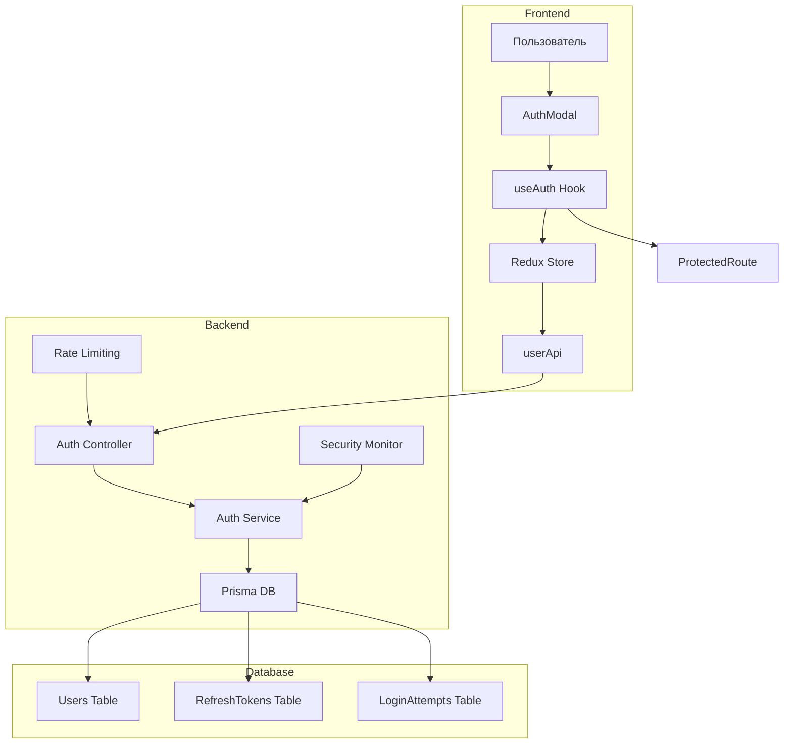

## Процесс регистрации

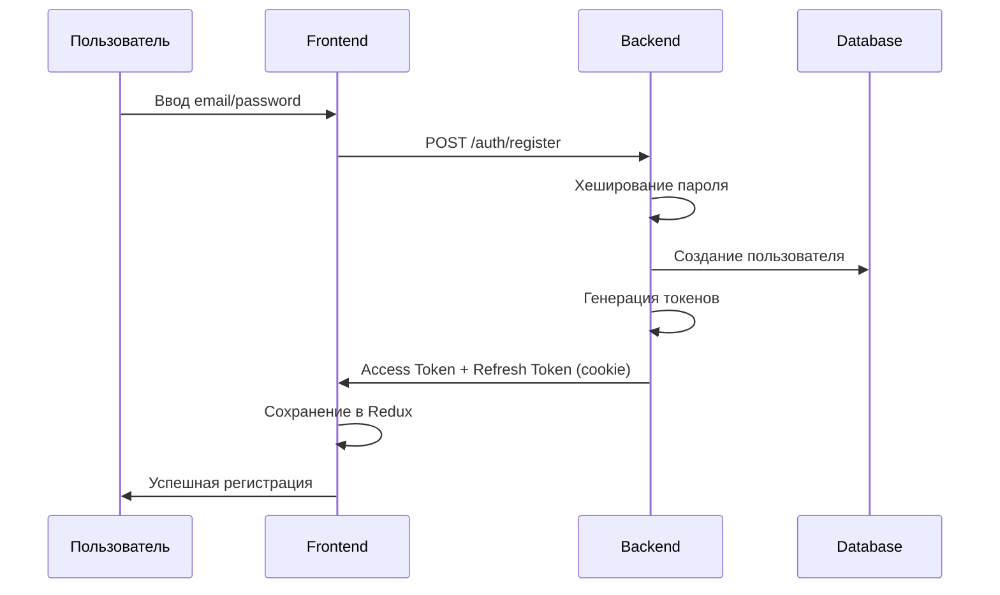

## Процесс входа

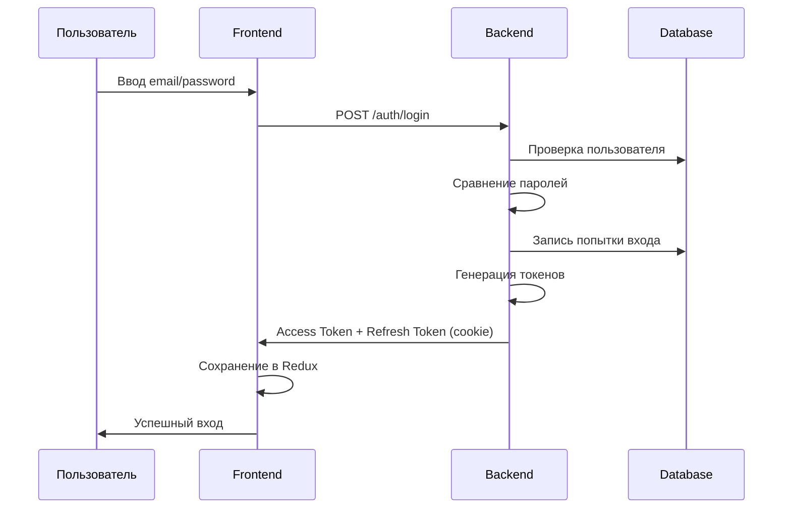

## Обновление токенов

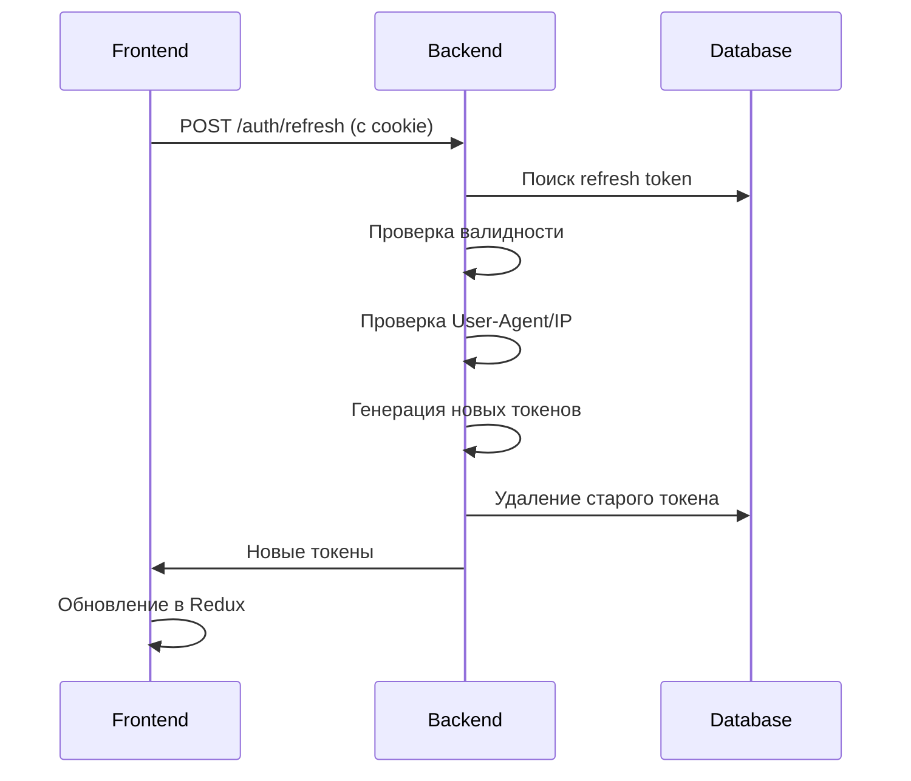

## Структура токенов

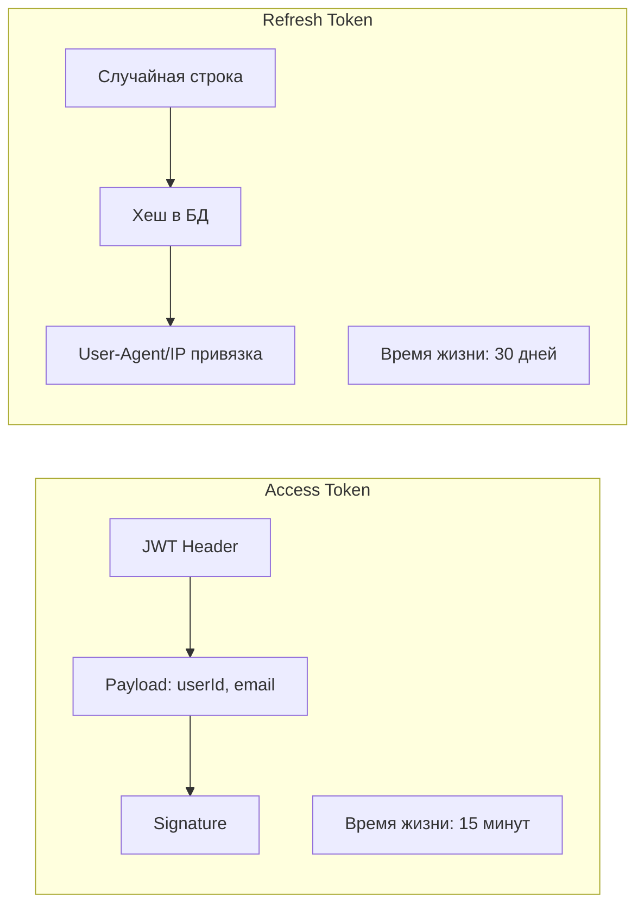

## Защита от атак

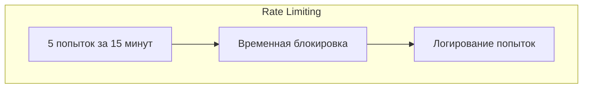

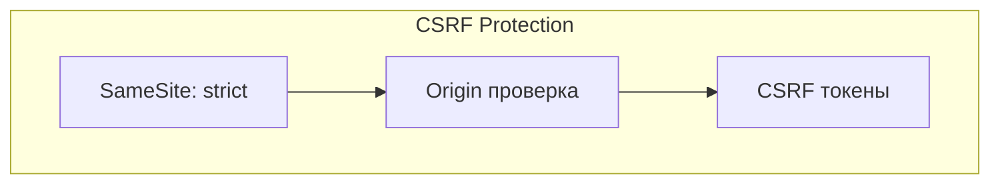

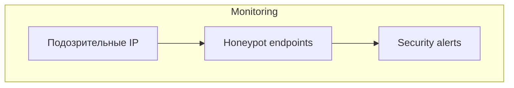

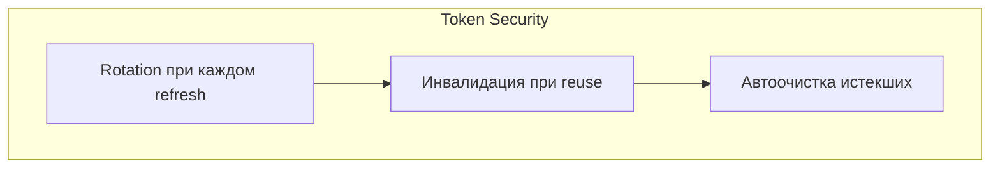

## Хранение данных

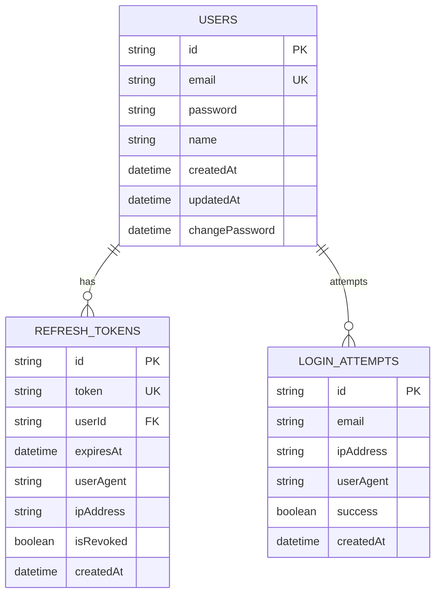

## Жизненный цикл токенов

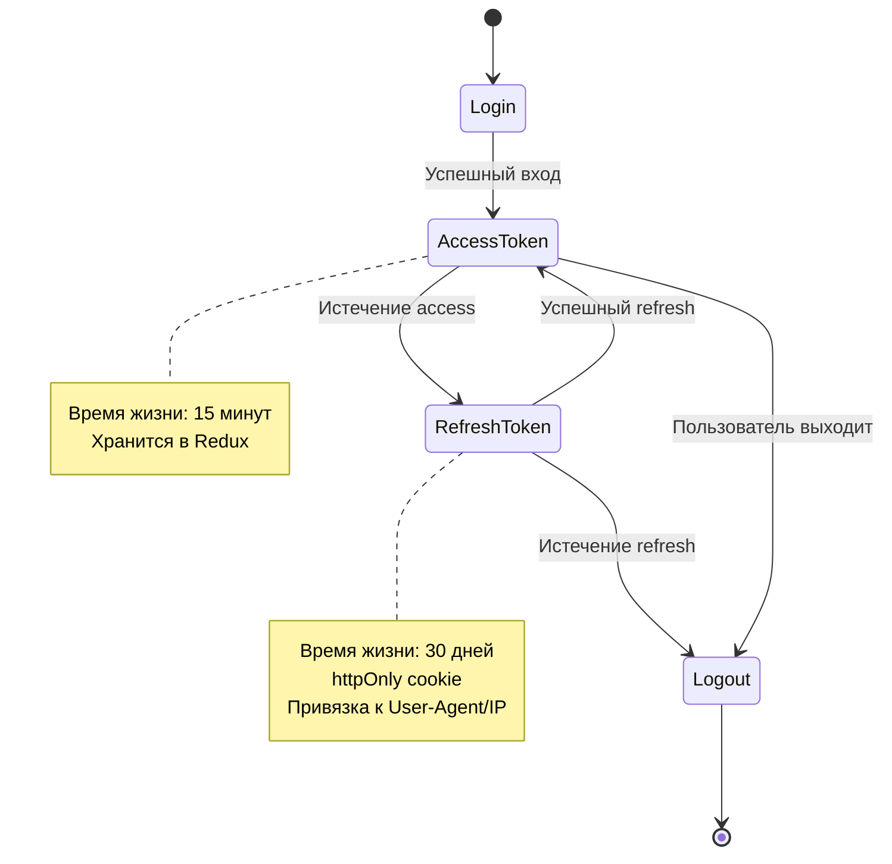

## Компоненты безопасности

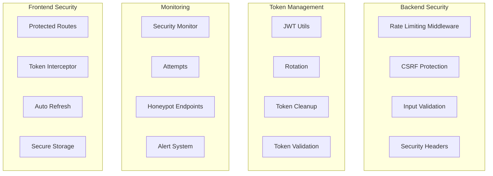

## API Endpoints

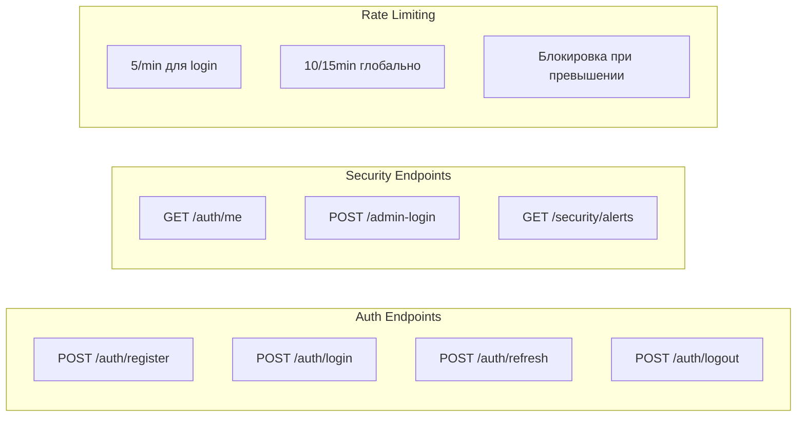

## Поток данных

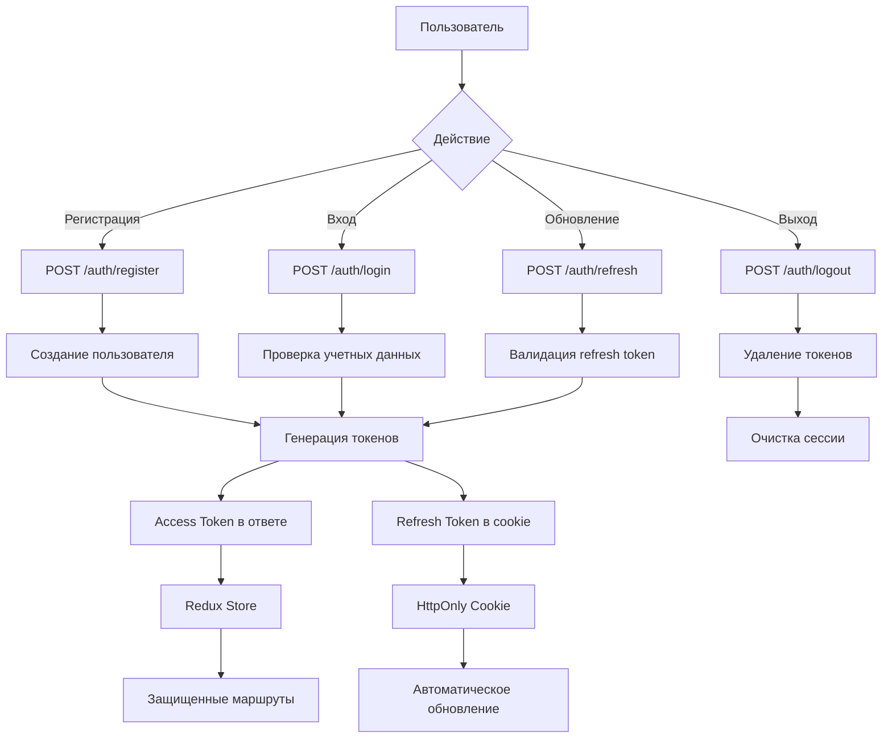

## Мониторинг безопасности

````mermaid
graph TB
    subgraph Security Checks
        SC1[Подозрительные IP]
        SC2[Token Reuse Detection]
        SC3[Rate Limit Exceeded]
        SC4[Honeypot Access]
    end

    subgraph Alerts
        A1[Email Notifications]
        A2[Log Entries]
        A3[Dashboard Alerts]
        A4[Admin Notifications]
    end

    subgraph Automation
        AM1[Token Cleanup]
        AM2[Security Monitoring]
        AM3[Alert Processing]
        AM4[Report Generation]
    end

    SC1 --> A1
    SC2 --> A2
    SC3 --> A3
    SC4 --> A4
    A1 --> AM1
    A2 --> AM2
    A3 --> AM3
    A4 --> AM4
```
````

---

## Ключевые особенности системы:

### 🔐 Безопасность

- **Refresh токены** в httpOnly cookies
- **Rate limiting** для защиты от брутфорса
- **CSRF защита** для всех auth endpoints
- **Token rotation** при каждом обновлении
- **User-Agent/IP привязка** для refresh токенов

### 📊 Мониторинг

- **Логирование** всех попыток входа
- **Honeypot endpoints** для обнаружения атак
- **Security alerts** при подозрительной активности
- **Автоматическая очистка** истекших токенов

### 🔄 UX

- **Автоматическое обновление** токенов
- **Прозрачная работа** для пользователя
- **Защищенные маршруты** с автоматической проверкой
- **Единообразные ошибки** для предотвращения атак перечислением

### 🛡️ Enterprise-уровень

- **RSA поддержка** для внешних клиентов
- **Расширенное логирование** безопасности
- **Готовность к продакшену** с cron jobs
- **Документация** по безопасности

```

```
